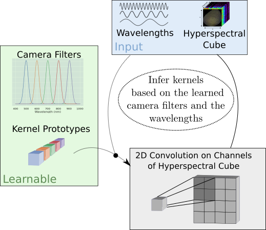
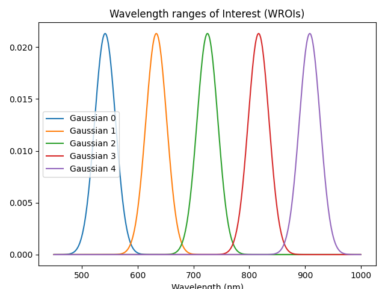
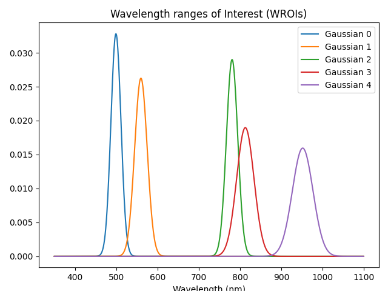
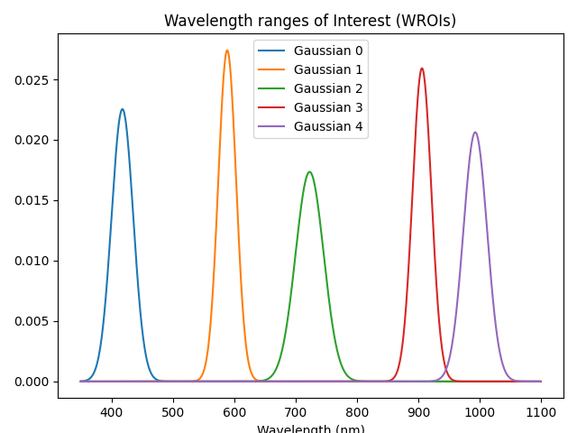

# HyveConv and HyveConv++
By introducing a suitable model bias and continuously defining the channel dimension, we propose a 2D convolution optimized for these challenges of Hyperspectral Imaging.
We evaluated the method based on two different hyperspectral applications (inline inspection and remote sensing). Besides the shown superiority of the model, the modification adds additional explanatory power.    
In addition, the model learns the necessary camera filters in a data-driven manner. Based on these camera filters, an optimal camera can be designed.
For a description of the approach, please look into the paper "Wavelength-aware 2D Convolutions for Hyperspectral Imaging".

<br>
**Figure 1** - Overview:


#FIXME description

# Requirements
All code is provided for Python 3.8 and PyTorch 1.10.
Please install the required packages with 
    ```pip3 install -r requirments.txt```

## Implementation of HyveConv/HyveConv++
The implementation of HyveConv/HyveConv++ can be found in `hyve/`. `hyve/hyve_convolution.py` provides the Pytorch Module of the convolution itself. `hyve/gaussian.py` contains the Gaussian component of the approach.
Besides the parameters of a 2D convolution, the following parameters are configurable:

num_of_wrois: This is parameter G, which defines the number of used camera filters
wavelength_range: A tuple, with: (min_wavelength, max_wavelength), necessary for the definition of the wavelength range.
enable_extension: Enables HvVEConv++ (default: True)
stop_gaussian_gradient: Prevent training of the Gaussians. Only for test purpose (default: False)

## Integration in a model
In the folder ```models/``` a shallow convolutional neural network DeepHS_net with the HyveConv++ as first layer can be found.
This was also integrated into version 2 of the DeepHS-training framework (https://github.com/cogsys-tuebingen/deephs_fruit).


## Script: Visualize the learned WROIs
This script can visualize a model's learned WROIs / camera filters and provides additional information on their overlap.

```PYTHONPATH=$PYTHONPATH:. python3 utils/visualize_wrois.py [path-to-checkpoint.pt]```

If no path is given, a freshly initialized model is evaluated. Example images:

<br>
**Figure 2** - Initialization of the WROIs:

<br>

**Figure 3** - Learned WROIs for the ripeness prediction of avocados:

<br>
**Figure 4** - Learned WROIs for the ripeness prediction of avocados:


## Script: Count trainable parameters
```PYTHONPATH=$PYTHONPATH:. python3 utils/size_comparsion.py```

This python script enumerates the parameters of different methods (Conv2d, HyveConv, HyveConv++).

## Cite as
```
@misc{https://doi.org/10.48550/arxiv.2209.03136,
  doi = {10.48550/ARXIV.2209.03136},  
  url = {https://arxiv.org/abs/2209.03136},  
  author = {Varga, Leon Amadeus and Messmer, Martin and Benbarka, Nuri and Zell, Andreas},  
  keywords = {Computer Vision and Pattern Recognition (cs.CV), FOS: Computer and information sciences, FOS: Computer and information sciences},  
  title = {Wavelength-aware 2D Convolutions for Hyperspectral Imaging},  
  publisher = {arXiv},  
  year = {2022},  
  copyright = {Creative Commons Attribution Share Alike 4.0 International}
  }

```

